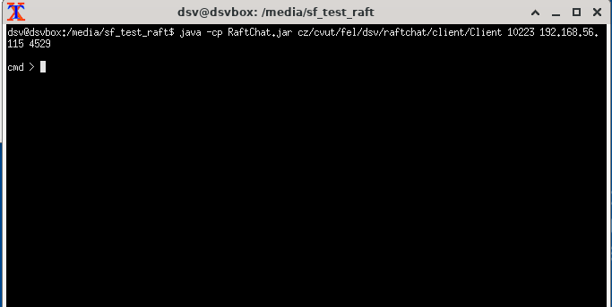
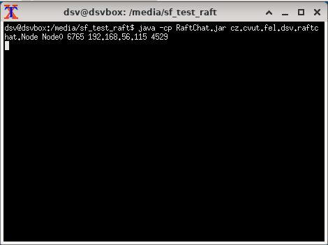
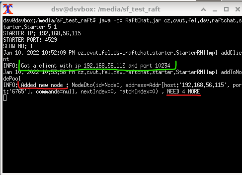

# RAFT-RMI

## Project description

Raft-rmi-chat is a project for subject DSV.
I didn't have so much time, and it is not actually a chat,
it is simply a messaging among all the nodes in system.
There are not a lot of commands to execute.  

As a client of the app, you can stop the Node, start it or send 
a message to all the Nodes. Also, when the app starts, it is possible 
to set the slow motion. I will describe how it works and how to use it
in section **Launch section**.

Project implements one of the simplest version of raft algorithm,
it means that there are no adding of Nodes, and it starts with fixed
amount of nodes. Also, the AppendEntries messages always contain only one log.

## Structure and "How it works"

Every node has a list of DTOs of other nodes. DTO contains the id of node,
for example "Node0", its Address and some default for Raft data. When node dto
is not fully initialized, and the Commander (The RMI class) is not initialized, node
is asking for the remote interface and then saves it in the DTO.

When the algorithm starts, every node is being in the follower state,
after some random calculated time (default if 150-300ms), if they don't
get any AppendEntry message, one of them (or may be more than one), change its
state to candidate and starts an elections. It increments its term and sends to everybody RequestVote
message. Every node, that gets that message, decides, weather vote for the node or not.
If node gets back half or more of the votes, it becomes a leader and starts sending AppendEntry messages
to every node. 

I have implemented the client the way, that user don't need to know, who is a current
leader. User just need to send the message, and it will find a leader itself, because every of node
have an information about current leader.

So when the client sends message to nodes, message finds the leader and leader adds it to its logs.
Then in the next HeartBeat message, it takes the log and put it in the message. After getting half of responses,
that message was successfully saved in Nodes, leader commits the message and tell every node 
to commit it also.

### Start of the system

For user-friendly start of application, I have created the Starter of the app.

It is actually one of 3 entry points in the application:
- Client
- Node
- Starter

It's a server, that collects Nodes and Client and than distribute the information for start between them. Takes as an input two parameters: number of all nodes in the system and slow motion multiplier.

When it starts, it writes down its ip address and port.
Then, we can start all other servers, firstly we need to connect the client.
Starter gets the information about the client, its ip and port.
After that, we can start every Node. In start parameters, we need to mention adress of starter
and when i starts, it sends message to Starter. Starter remembers the info about the node and countdown
total needed Nodes to start. When you reach the needed amount of Nodes, it 
automatically sends all the info about nodes to every of the node and to client.

After that, all the system starts working.

## How to start the app

There is a strict order, how to start servers:
### Starter
At first, you need to start the starter: 
java -cp RaftChat.jar cz.cvut.fel.dsv.raftchat.starter.Starter "NUMBER OF ALL NODES" "SLO-MO MULTIPLIER"

What is slo-mo multiplier:
Default random wait time is 150-300ms, multiplier just multiply it with the number
in parameters. Every other fixed waiting times are also multiplied.

Be careful, it takes only integers.

In case of correct commands, you will see on screen STARTER PORT,
STARTER IP and SLO-MO number.

### Client
Then you need to start the client. You can start it even later, but
strictly before starting last NODE.

java -cp RaftChat.jar cz.cvut.fel.dsv.raftchat.client.Client "CLIENT PORT" "STARTER IP" "STARTER PORT"

In case of correct command, you will see the cmd>.
Also, you will see the connection in the Starter logs (last screenshot).

### Nodes
After client, you can start all other nodes with this command:

java -cp RaftChat.jar cz.cvut.fel.dsv.raftchat.Node "NODE ID" "NODE PORT" "STARTER IP" "STARTER PORT"

If everything is ok, you will not see anything new in Node cmd, but 
you will see adding ti pool in starter(last screenshot)

**WHEN YOU START NUMBER OF NODES MENTIONED IN STARTER, PROCESSES WILL
AUTOMATICALLY START AND YOU WILL BE ABLE TO CONTROL NODES FROM THE CLIENT CMD.**

